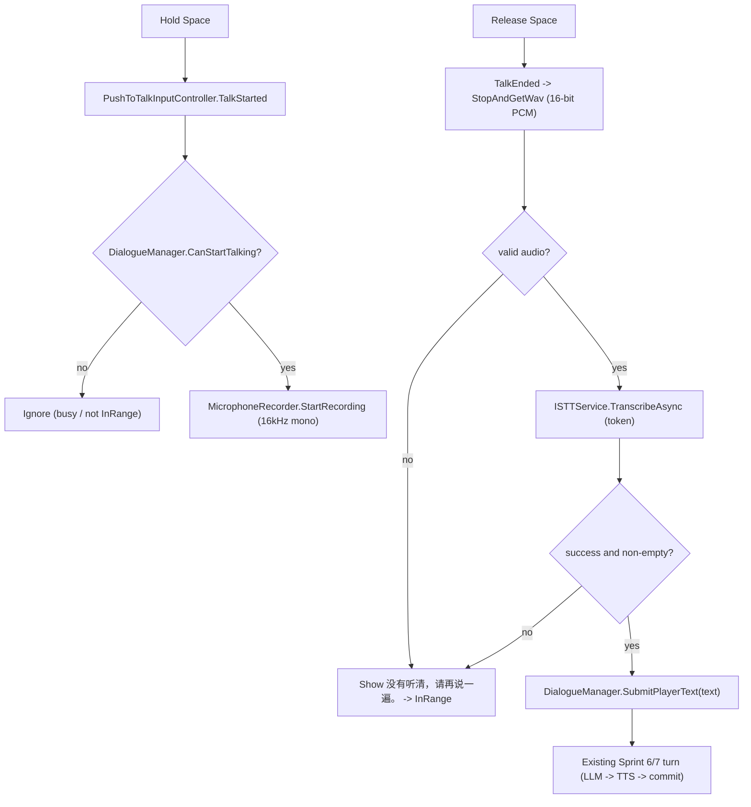

# Sprint 8 Plan: Microphone Recording, Push-To-Talk, and Real STT

## 1. Goal

Feed real voice input into the SAME dialogue flow built in Sprint 6/7. Hold Space to start
recording, release Space to stop, encode the captured audio to WAV, send it to the real
`ISTTService`, and submit the recognized text through the existing
`DialogueManager` -> `DialoguePipeline` path (identical to Debug text input). Keep Debug
text input for STT-free troubleshooting.

Do NOT touch the LLM/TTS flow, do NOT implement quest judgment, do NOT refactor UI.

## 2. Current state (verified)

- Input System `com.unity.inputsystem` 1.19.0 is installed; `ProjectSettings activeInputHandler: 2` (Both), so Input System APIs work and legacy input still works. No project-setting change required.
- `ISTTService` exists with both implementations and is built by the factory:
  - `[ISTTService](Assets/Scripts/Services/ISTTService.cs)`: `Task<ServiceResult<string>> TranscribeAsync(STTRequest, CancellationToken)`.
  - `[ServiceFactory.CreateSTTService](Assets/Scripts/Services/ServiceFactory.cs)` returns Whisper or Azure from settings.
  - `[STTRequest](Assets/Scripts/Services/Common/ServiceModels.cs)`: `byte[] AudioBytes`, `string Language`, `string Format = "wav"`.
  - Whisper posts multipart `audio.wav`; Azure posts `audio/wav; codecs=audio/pcm` and reads sample rate from the WAV header. So a standard 16-bit PCM mono WAV satisfies both.
- `[DialogueManager](Assets/Scripts/Dialogue/DialogueManager.cs)` already owns services (`_llm/_tts`), state (`Idle/InRange/Thinking/Speaking`), the single-turn gate, and the Sprint 7 session/cancellation logic. Debug text enters via `OnDebugTextSubmitted` -> `BeginTurn`.
- `[WavUtility](Assets/Scripts/Utils/WavUtility.cs)` can DECODE WAV -> AudioClip but has no ENCODER yet.
- `[InteractionHintUI](Assets/Scripts/UI/InteractionHintUI.cs)` already shows the "按住空格说话" hint, so the UX prompt exists.
- Architecture rule (`Docs/Architecture.md` 18.4): business modules must not read `Input.GetKey` directly; input belongs in `Assets/Scripts/Input` behind a Talk action wrapper.

## 3. Input scheme

Use the Unity Input System with a dedicated Talk action (technical requirement 1).

- New `Assets/Scripts/Input/PushToTalkInputController.cs` (MonoBehaviour):
  - Wraps an `InputAction` bound to `<Keyboard>/space` (created in code via `new InputAction(type: Button, binding: "<Keyboard>/space")`, or referenced from a small `.inputactions` asset). Code-created action keeps the diff minimal and avoids editing scene/asset GUIDs.
  - Exposes events `event Action TalkStarted;` / `event Action TalkEnded;` raised from `action.started` (press) and `action.canceled` (release). Enables on `OnEnable`, disables on `OnDisable`.
  - Whole file guarded by `#if ENABLE_INPUT_SYSTEM`. In the `#else` branch, log a clear "Install com.unity.inputsystem (Window > Package Manager) to use Push-To-Talk" warning so the "prompt to install if missing" requirement is honored.
  - No other module reads raw input; consumers subscribe to these events only.

## 4. Recording data format

New `Assets/Scripts/Audio/MicrophoneRecorder.cs` (plain MonoBehaviour, main-thread):

- Capture: `Microphone.Start(device, loop:false, maxSeconds, sampleRate)` with `sampleRate = 16000`, mono. 16 kHz mono matches Azure's recommendation and is fine for Whisper, and keeps payloads small.
- Track start time; expose `IsRecording` and `ElapsedSeconds` for the debug panel.
- Stop: read `Microphone.GetPosition(device)` to find the real sample count, `Microphone.End(device)`, `clip.GetData(float[] , 0)`, trim to the recorded length.
- Encode: add `WavUtility.EncodeToWav16(float[] samples, int channels, int sampleRate)` returning a 16-bit PCM RIFF/WAVE `byte[]` (44-byte header + PCM body). `MicrophoneRecorder.StopAndGetWav()` returns that `byte[]`.
- Error handling (technical requirement 2):
  - No device: `Microphone.devices.Length == 0` -> return a typed failure ("麦克风不可用").
  - Permission: call `Application.RequestUserAuthorization(UserAuthorization.Microphone)` before first capture; if denied -> failure ("麦克风权限不足"). (No-op/auto-granted on desktop.)
  - Too short: if `ElapsedSeconds < minSeconds` (e.g. 0.3s) -> discard, treat as empty -> "没有听清，请再说一遍。"
  - Too long: cap at `maxSeconds` (e.g. 15s); auto-stop and still transcribe what was captured.

## 5. STT call and pipeline submission

- `DialogueManager` builds `_stt = ServiceFactory.CreateSTTService(settings)` alongside `_llm/_tts` in `BuildServices()` (single service owner; no interface changes).
- New coordinator `Assets/Scripts/Dialogue/VoiceInputController.cs` (MonoBehaviour) wires it together:
  - References `PushToTalkInputController`, `MicrophoneRecorder`, and `DialogueManager`.
  - `OnTalkStarted`: only if `DialogueManager.CanStartTalking` (new read-only `=> state == InRange && active NPC != null`) and not already recording/transcribing -> `micRecorder.StartRecording()`, set `DebugStateStore` recording=true.
  - `OnTalkEnded`: stop recording -> `byte[] wav`; set recording=false. If recorder returned an error or empty -> show "没有听清，请再说一遍。" and stay InRange. Otherwise `await _stt.TranscribeAsync(new STTRequest(wav, settings.Stt.ResolveLanguage(), "wav"), token)`.
  - On success with non-empty text -> `DialogueManager.SubmitPlayerText(text)`. On failure/empty -> `DebugStateStore.SetLastSttError(...)`, subtitle "没有听清，请再说一遍。", remain InRange.
- Unified entry point: add public `DialogueManager.SubmitPlayerText(string playerText)` that contains the existing gate + `BeginTurn` logic. Refactor `OnDebugTextSubmitted` to call it. (NOTE: the brief says `DialoguePipeline.SubmitPlayerText`; the host owns state/gating, so the method lives on `DialogueManager` and the pipeline stays unchanged per "don't change LLM/TTS flow".)

## 6. Gating (requirement 6)

Recording may start ONLY in `InRange`. While `Thinking` (LLMProcessing), `Speaking` (TTS generating/playing), or during commit, `CanStartTalking` is false and `OnTalkStarted` is ignored. A talk press is also ignored while a previous recording/STT is still in flight.

Mid-leave safety: if the active NPC clears during recording or STT, cancel via a recorder/STT `CancellationTokenSource` (cancelled in `OnActiveNpcCleared`), stop the mic, discard audio, and do NOT submit. Reuse the Sprint 7 pattern of re-checking state/NPC before side effects.

## 7. Error recovery (requirement 7)

Every failure path (no mic, no permission, too short, STT failure, empty transcript) ends by:
1. Stopping the mic and clearing recording state.
2. Setting `DebugStateStore.LastSttError`.
3. Showing subtitle "没有听清，请再说一遍。" (only when the player actually attempted to speak).
4. Returning to `InRange` so the next press works. No turn is started, no History written.

## 8. DebugPanel additions (requirement 3)

- `[DebugStateStore](Assets/Scripts/DebugTools/DebugStateStore.cs)`: add `bool Recording`, `float RecordingSeconds`, `string LastSttError` with setters (raise `Changed`) and reset coverage. (`LastSttText` already exists.)
- `[DebugPanelUI](Assets/Scripts/UI/DebugPanelUI.cs)`: render lines for `Recording: yes/no`, `Rec Seconds`, and `STT Error`. `VoiceInputController` updates `RecordingSeconds` each frame while recording.

## 9. Files

New:
- `Assets/Scripts/Input/PushToTalkInputController.cs`
- `Assets/Scripts/Audio/MicrophoneRecorder.cs`
- `Assets/Scripts/Dialogue/VoiceInputController.cs`

Modified:
- `Assets/Scripts/Utils/WavUtility.cs` (add `EncodeToWav16`).
- `Assets/Scripts/Dialogue/DialogueManager.cs` (build `_stt`, add `CanStartTalking`, add public `SubmitPlayerText`, refactor `OnDebugTextSubmitted`, cancel mic/STT on NPC clear).
- `Assets/Scripts/DebugTools/DebugStateStore.cs` (recording/STT fields).
- `Assets/Scripts/UI/DebugPanelUI.cs` (render new fields).

Out of scope: no changes to `DialoguePipeline`, LLM/TTS services, quest system, or UI layout.

## 10. Data flow



## 11. Self-test steps

1. Happy path: stand in NPC range (InRange), hold Space, speak a short English line, release. DebugPanel shows Recording yes -> no, Rec Seconds increasing, then Last STT text populated; the normal LLM/TTS turn runs and History +1.
2. Busy gating: during Thinking/Speaking, hold Space -> nothing records (Recording stays no); turn continues uninterrupted.
3. Empty/short: tap Space briefly (no speech) -> subtitle "没有听清，请再说一遍。", STT Error set, state back to InRange, no turn.
4. STT failure: temporarily break the STT key/endpoint -> "没有听清，请再说一遍。", STT Error shows the failure, InRange.
5. No microphone: disable/unplug mic -> on press, error "麦克风不可用", no crash, InRange.
6. Mid-leave: start recording, walk out of range before release -> recording stops, audio discarded, no STT submit, state -> Idle.
7. Debug text still works: type in the Debug input box -> same turn flow (confirms shared `SubmitPlayerText`).
8. Max length: hold Space > maxSeconds -> auto-stops at cap and still transcribes.

Editor note: playmode self-tests must be run in Unity `6000.3.15f1` (the only locally installed editor is `2021.3.23f1`, which must NOT open this project).
```
